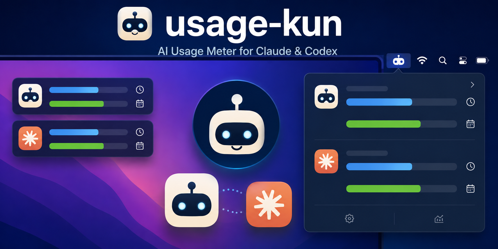
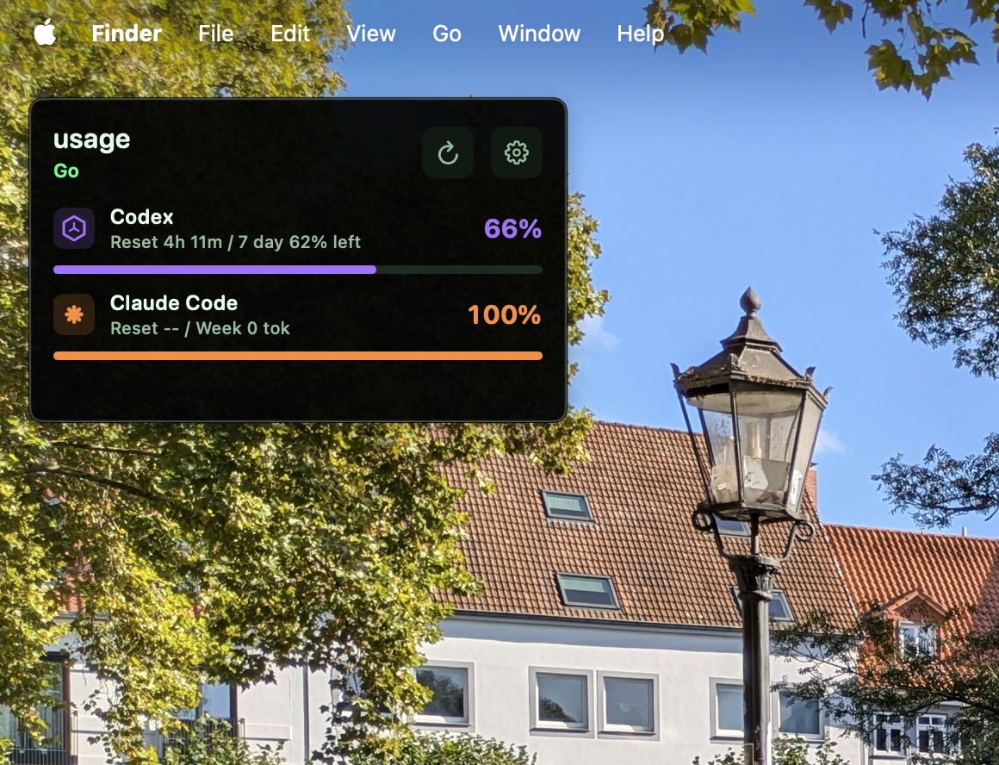
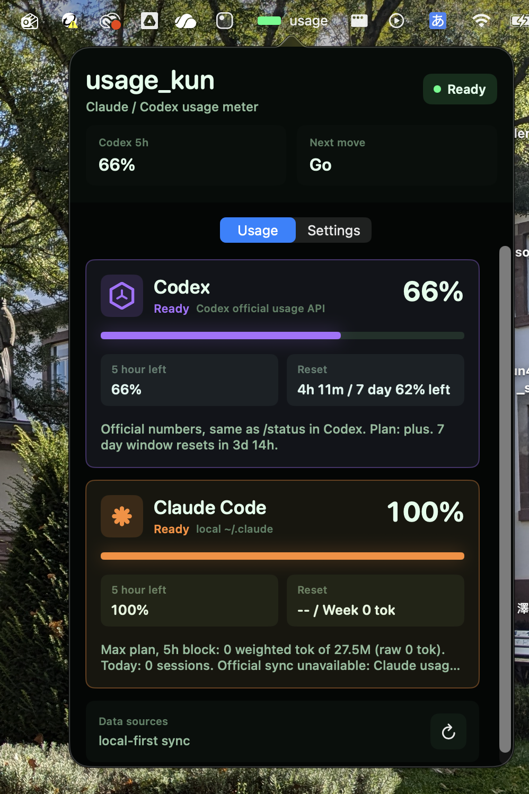

# usage-kun

<p align="center">
  
</p>

<p align="right">
  <a href="README.md">English</a> |
  <strong>日本語</strong>
</p>

usage-kun は、Claude と Codex の使用量を作業中にすぐ確認するための、privacy-first な macOS メニューバーアプリです。

これは個人用の小さなユーティリティとして作っています。大きな分析ダッシュボードではなく、作業中に一瞬見るための使用量メーターです。初期状態ではローカル CLI ログを読み、必要な場合だけ opt-in で Claude Code / Codex CLI サインイン token を読み取り専用で再利用し、公式の 5-hour / 1-week 残量を取得します。この app は token を保存・更新・log 出力しません。

このプロジェクトは OpenAI、Anthropic、その他 provider の公式アプリではありません。各社による承認・提携・提供を受けたものでもありません。

## スクリーンショット

usage-kun は、作業画面の邪魔をせずに常に見えることを意識しています。固定デスクトップメーターでは 5-hour primary window と 1-week secondary window を左上に表示し、メニューバーの popover では provider ごとの詳細を確認できます。

<p align="center">
  
</p>

<p align="center">
  <em>5-hour と 1-week の残量を小さく確認できる固定デスクトップメーター。</em>
</p>

<p align="center">
  
</p>

<p align="center">
  <em>メニューバーから開く詳細 popover。provider ごとの残量、reset、設定にすぐアクセスできます。</em>
</p>

## 機能

- SwiftPM、AppKit、SwiftUI で作った native macOS メニューバーアプリ
- メニューバーから開く provider card つき compact popover
- ひと目確認用の固定デスクトップウィジェット
- Claude Code / Codex の 5-hour primary window と 1-week secondary window のバー表示
- 公式同期が使えない場合のローカルログに基づく使用量推定
- Claude Code / Codex CLI サインインを利用した opt-in の公式使用量 sync
- `.app` 版での低残量・reset 通知
- token を保存・更新・log 出力しない read-only な token 再利用
- telemetry や analytics SDK は含めない

## 必要環境

- macOS 14 以降
- Swift 6 以降
- Xcode Command Line Tools

## すぐ試す

### Release ZIP からインストール

1. [Releases](https://github.com/Kohei-SAWADA/usage_kun/releases/latest) から最新の `UsageKun-macOS.zip` を download します。
2. 展開して `UsageKun.app` を `/Applications` など好きな場所に移動します。
3. `UsageKun.app` を開きます。

### 初回起動時:「マルウェアが含まれていないことを確認できませんでした」と出る場合

初回起動時に、macOS が次のような dialog で app をブロックします。

> Apple は、"UsageKun" にマルウェアが含まれていないことを確認できませんでした。

**これは想定内の表示で、download が壊れているわけではありません。** この app は署名済みですが Apple の notarization(公証)を受けていないため(有料の Apple Developer アカウントが必要)、macOS が自動では安全性を保証できず、この警告が出ます。次の手順で一度だけ許可すれば、以後は普通に起動できます。

1. 警告 dialog では **「完了」** を押します(**「ゴミ箱に入れる」は押さない**でください)。
2. **システム設定** > **プライバシーとセキュリティ** を開きます。
3. 下にスクロールすると、**セキュリティ** の欄に「"UsageKun" はブロックされました」というメッセージが表示されています。
4. その横の **「このまま開く」** を押します。
5. 確認 dialog でもう一度 **「このまま開く」** を押し、Touch ID または password で認証します。

これ以降、警告は表示されません(新しい version を download したときに再度同じ手順が必要になるだけです)。

dialog を経由せず Terminal で quarantine flag を外す方法もあります(効果は同じです):

```sh
xattr -d com.apple.quarantine /Applications/UsageKun.app
```

download した binary をそもそも信頼したくない場合は、下記の手順でソースから build してください。結果は同じで、Gatekeeper の承認も不要です。

### ソースから実行

ソースから実行:

```sh
swift run
```

`.app` bundle を作成:

```sh
./Scripts/package_app.sh
open UsageKun.app
```

軽量な core check を実行:

```sh
swift build
swift run UsageKunCoreCheck
```

この repo には `UsageKunCoreCheck` が含まれています。Command Line Tools だけの環境では `XCTest` や Swift Testing がうまく使えない場合があるため、実行可能 target として最低限の core check を用意しています。

Claude のローカル 5-hour 推定と較正状態を確認する場合:

```sh
swift run UsageKunCoreCheck --claude-estimate
```

## 既に使っている場合のアップデート

設定や較正データは app bundle の外に保存されているため、app を更新しても通常は設定は消えません。`~/.codex`、`~/.claude`、`~/Library/Application Support/usage_kun` を削除する必要はありません。

### Git clone で入れた場合

すでに clone してある repository directory で次を実行します:

```sh
cd usage_kun
git pull
./Scripts/package_app.sh
open UsageKun.app
```

`package_app.sh` は release executable を作り直し、起動中の `UsageKun` process があれば停止してから、ローカルの `UsageKun.app` bundle を新しいものに置き換えます。

### GitHub の Download ZIP で入れた場合

GitHub から最新の source ZIP を download して展開し、展開した `usage_kun` folder を Terminal で開いて次を実行します:

```sh
./Scripts/package_app.sh
open UsageKun.app
```

### Release ZIP で入れた場合

1. [Releases](https://github.com/Kohei-SAWADA/usage_kun/releases/latest) から最新の `UsageKun-macOS.zip` を download します。
2. メニューバーから古い usage-kun を終了します。
3. `UsageKun-macOS.zip` を展開します。
4. 古い `UsageKun.app` を新しい `UsageKun.app` に置き換えます。
5. 新しい `UsageKun.app` を開きます。

新しい version の初回起動時に「マルウェアが含まれていないことを確認できませんでした」の警告が再度出ることがあります。その場合は [初回起動時の手順](#初回起動時マルウェアが含まれていないことを確認できませんでしたと出る場合) と同じ方法で許可してください。Claude 公式 sync を有効にしている場合、更新後に macOS が Claude Code の Keychain access を再度確認することがあります。

## データソース

usage-kun は段階的なデータ取得モデルを使います。

1. Local logs: Claude Code と Codex の既知のローカル使用量ログを読んで推定します。
2. Official usage sync: opt-in の場合のみ、ローカル CLI サインイン token を読み取り専用で再利用し、provider の 5-hour / 1-week 使用量 endpoint から値を取得します。
3. Claude calibration: Claude 公式 sync が成功した場合、その時点の公式値を使ってローカル推定用の 5-hour cap を較正できます。

詳細は [docs/providers.md](docs/providers.md) を参照してください。

## プライバシー方針

- telemetry はありません。
- cloud sync はありません。
- analytics SDK はありません。
- 会話本文の表示や外部送信はしません。
- browser cookie の自動読み取りはしません。
- CLI sign-in token は refresh せず、app 内に保存せず、log に出しません。
- この release では Admin API key や manual cookie header を収集しません。

詳しくは [PRIVACY.md](PRIVACY.md) を参照してください。

## リポジトリ構成

```text
Sources/UsageKun/
  main.swift
  Services/
    LaunchAtLoginService.swift
    UsageNotifier.swift
  Views/

Sources/UsageKunCore/
  Config/
    AppConfig.swift
    ClaudeCalibrationStore.swift
  OnboardingDetector.swift
  Providers/
    CLIOAuthUsageService.swift
    LocalLogUsageService.swift
  UsageNotificationPlanner.swift
  UsageSnapshot.swift
  UsageService.swift

Tests/UsageKunCoreCheck/
  main.swift

assets/screenshots/
  pinned-desktop-meter.png
  menu-bar-popover.png

Packaging/
  Info.plist

Scripts/
  package_app.sh
  package_release_zip.sh
  preflight_publication.sh
```

## なぜ別の使用量メーターを作るのか

AI 使用量 monitor や menu bar utility はすでに複数あります。usage-kun は、その中で「Claude と Codex の残量を dashboard を開かずに見たい」という 1 つの workflow に絞った、小さく監査しやすい実装です。

重視している点:

- local-first な動作
- provider ごとの境界を混ぜない設計
- 小さな native macOS UI
- 読みやすい Swift code
- privacy-first な credential handling

## 制限

- 公式 usage endpoint は予告なく変わる可能性があります。
- Claude local-log quota 推定は best-effort です。`requestId` と `message.id` による重複排除を行い、opt-in の Claude 公式使用量 sync が成功した後は cap を自己較正できます。
- 公式 sync には、同じ Mac 上に Claude Code / Codex CLI のサインイン状態が必要です。
- 通知は packaged app (`UsageKun.app`) での利用を想定しています。
- この app は ad-hoc 署名のみで notarization はしていないため、download した copy の初回起動時に一度だけ Gatekeeper の許可が必要です。

## リリース履歴

### v0.2.2

ローカル推定のプラン判別を修正した release です。

- ローカル Claude 推定で Max 20x プランが Max 5x として扱われ、使用率が約 4 倍過大表示されていた問題を修正しました。5x/20x の区別が実際に入っている `~/.claude.json` の rate-limit tier フィールドを読むようにしました。
- 自動判別が外れた場合のために「Claude plan」設定 (Auto / Pro / Max 5x / Max 20x) を追加しました。ローカル推定にのみ影響し、公式同期は常に正確です。
- Codex の live rate-limit 読み取りで primary window がちょうど 300 分であることを要求しないようにしました。

詳細: [docs/release-notes-v0.2.2.md](docs/release-notes-v0.2.2.md)

### v0.2.1

packaging とセキュリティ強化の release です。機能変更はありません。

- release zip 内の app の署名が不完全で、download した copy を Gatekeeper が「壊れているため開けません」と拒否していた問題を修正しました。bundle 全体を sealed resources つきで ad-hoc 署名し、packaging 時に検証するようにしました。
- release zip に拡張属性が AppleDouble `._*` ファイルとして混入しないようにしました。
- Codex のローカル database を `sqlite3 -readonly -batch` で開くようにしました。
- CI workflow の token を read-only に制限しました。
- Release ZIP からのインストール手順と、初回のみ必要な Gatekeeper 許可を README に記載しました。

詳細: [docs/release-notes-v0.2.1.md](docs/release-notes-v0.2.1.md)

### v0.2.0

今回の更新では、usage-kun を 5-hour と 1-week の両方を見やすく確認できる quota monitor として整理しました。

- Claude Code / Codex の 5-hour window と 1-week window を正式な表示対象として追加しました。
- 固定デスクトップメーターとメニューバー popover を再設計し、primary / secondary の quota bar を見やすくしました。
- メニューバー表示は `usage` と残量メーターの compact な形に保ちました。
- 公式 CLI usage sync の one-click onboarding を追加しました。
- packaged app での低残量通知と reset 通知を追加しました。
- 使わなくなった Admin API と Cookie/OAuth 系 code path を削除しました。
- ローカル専用ファイル、build output、app bundle、release artifact の混入を防ぐ publication preflight を追加しました。

詳細: [docs/release-notes-v0.2.0.md](docs/release-notes-v0.2.0.md)

### v0.1.1

この更新では、既存の Codex 表示ロジックは維持したまま、Claude Code の 5-hour 推定精度を重点的に改善しました。

- Claude local JSONL の重複行を `(requestId, message.id)` のペアで除外し、ローカル推定の精度を改善しました。
- 重複排除後の weighted token に合わせて、Claude の 5-hour cap 初期値を再較正しました。
- opt-in の Claude 公式使用量 sync が成功した後、Claude cap を自動較正できるようにしました。
- `swift run UsageKunCoreCheck --claude-estimate` で Claude のローカル推定を確認できるようにしました。
- Opus / Fable / Mythos の価格判定と cache-write token の二重計上を修正しました。

詳細: [docs/release-notes-v0.1.1.md](docs/release-notes-v0.1.1.md)

### v0.1.0

初回公開版です。

- Claude / Codex の native macOS メニューバー使用量メーターを公開しました。
- 固定デスクトップウィジェットを追加しました。
- local-first な使用量表示を中心にしました。
- privacy-first な credential handling と no telemetry を基本方針にしました。

## 開発

```sh
swift build
swift run UsageKunCoreCheck
```

release 風の app bundle を作成:

```sh
./Scripts/package_app.sh
```

公開前 preflight を実行:

```sh
./Scripts/preflight_publication.sh
```

release 用 zip を作成:

```sh
./Scripts/package_release_zip.sh
```

## ライセンス

MIT。詳細は [LICENSE](LICENSE) を参照してください。
