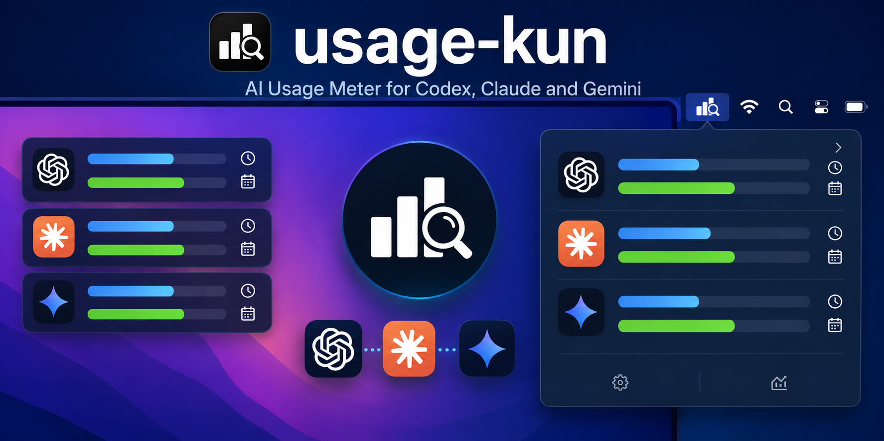
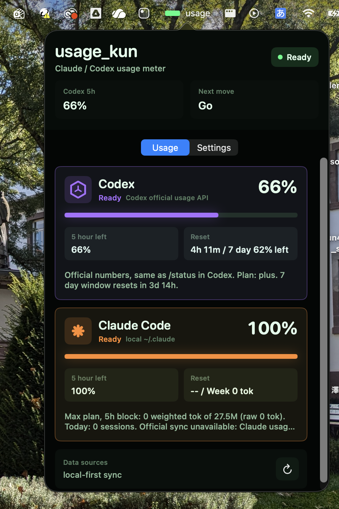
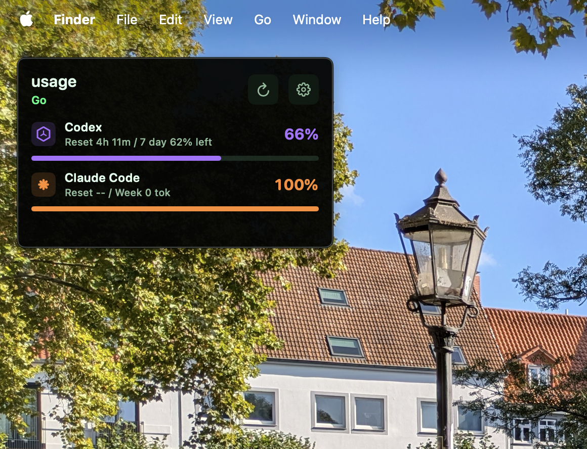
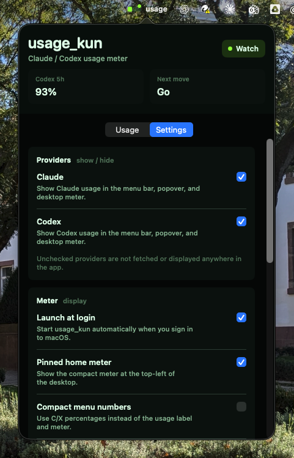

# usage-kun

<p align="center">
  
</p>

<p align="center">
  
</p>

<p align="right">
  <a href="README.md">English</a> |
  <strong>日本語</strong>
</p>

usage-kun は、Codex、Claude、Gemini（Antigravity）の使用量を作業中にすぐ確認できる、プライバシーを重視した小さな常駐アプリです。macOS ではメニューバー、Windows ではシステムトレイとデスクトップのメーターから確認できます。Gemini の表示は設定から有効にできます。

これは個人用の小さなユーティリティとして作っています。大きな分析ダッシュボードではなく、作業中に一瞬見るための使用量メーターです。初期状態ではローカル CLI ログを読み、必要な場合だけ Claude Code / Codex CLI の既存のサインイン状態を読み取り専用で再利用し、公式の残量を取得します。Codex は実際の制限期間に合わせて 5 時間・1 週間などを表示します。このアプリは認証トークンを保存・更新・ログ出力しません。

このプロジェクトは OpenAI、Anthropic、その他 provider の公式アプリではありません。各社による承認・提携・提供を受けたものでもありません。

## ダウンロード

現在の最新バージョンは [v0.4.2](https://github.com/Kohei-SAWADA/usage_kun/releases/tag/v0.4.2) です。Windows の対応対象は Intel / AMD（x64）の PC のみです。Apple Silicon の Mac 上で動く Windows を含め、Windows ARM の対応は終了しました。Apple Silicon を含む macOS の対応は従来どおりです。Gemini（Antigravity）対応は macOS では v0.4.0 から、Windows では v0.4.1 から利用できます。

[最新リリース](https://github.com/Kohei-SAWADA/usage_kun/releases/latest)から、お使いの環境に合う ZIP を選んでください。下のリンクから直接ダウンロードできます。

| 環境 | ZIP |
| --- | --- |
| macOS（Apple Silicon） | [UsageKun-macOS.zip](https://github.com/Kohei-SAWADA/usage_kun/releases/latest/download/UsageKun-macOS.zip) |
| Windows（Intel / AMD、x64） | [UsageKun-Windows-x64.zip](https://github.com/Kohei-SAWADA/usage_kun/releases/latest/download/UsageKun-Windows-x64.zip) |

Windows 版は .NET ランタイムを同梱しているため、追加の .NET インストールやビルドは不要です。GitHub の **Code > Download ZIP** やリリース欄の **Source code** は開発用ソースなので、アプリを使う場合は上記の ZIP を選んでください。

導入手順: [Windows](#windows-版をインストール) / [macOS](#release-zip-からインストール) / [Gemini を有効にする](#geminiantigravityを有効にする)。Windows の詳細は [Windows ガイド](docs/windows.md)を参照してください。

## スクリーンショット

usage-kun は、作業画面の邪魔をせずに常に見えることを意識しています。macOS 右上のメニューバーアイコンをクリックすると popover が開き、左上には固定ホームメーターを表示できます。Settings > Providers で Codex、Claude、Gemini（Antigravity）の表示を個別に切り替えられます。Windows ではシステムトレイと移動可能なフローティングメーターから確認できます。

以下は Codex と Claude を表示した macOS 版の画像です。設定画面の画像は Gemini 追加前のもので、現在は Gemini（Antigravity）の項目もあります。

<p align="center">
  
</p>

<p align="center">
  <em>macOS 右上のメニューバーアイコンから開く app 画面。</em>
</p>

<p align="center">
  
</p>

<p align="center">
  <em>PC ホーム画面の左上に表示する固定ホームメーター。</em>
</p>

<p align="center">
  
</p>

<p align="center">
  <em>Settings の provider checkbox で Codex だけ / Claude だけ / 両方を切り替えられます。</em>
</p>

## 機能

- SwiftPM、AppKit、SwiftUI で作った native macOS メニューバーアプリ
- .NET 8 / WPF で作った Windows システムトレイアプリ（Intel / AMD、x64）
- メニューバーから開く provider card つき compact popover
- ひと目確認用の固定デスクトップウィジェット
- Claude Code の使用量バーと、実際の制限期間に合った Codex の表示（週制限のみのプランにも対応）
- 起動中の Antigravity IDE から Gemini の 5 時間・1 週間の残量を表示（任意で有効化）
- Codex、Claude、Gemini（Antigravity）を個別に選べるプロバイダ表示チェック欄
- 公式同期が使えない場合のローカルログに基づく使用量推定
- Claude Code / Codex CLI サインインを利用した opt-in の公式使用量 sync
- macOS の `.app` 版での低残量・reset 通知
- token を保存・更新・log 出力しない read-only な token 再利用
- telemetry や analytics SDK は含めない

## 必要環境

- macOS 14 以降、または Windows 10 / 11（Intel / AMD、x64 のみ）
- macOS の配布 ZIP は Apple Silicon 用です。Intel Mac ではソースからビルドしてください。
- ソースからビルドする場合のみ、macOS は Swift 6 以降と Xcode Command Line Tools、Windows は .NET 8 SDK が必要です。
- 公式同期を使う場合は、usage-kun と同じ OS・ユーザーで Claude Code / Codex CLI にサインインしてください。Gemini を使う場合は、その環境で Antigravity IDE を起動し、サインインしたままにしてください。

## すぐ試す

### Release ZIP からインストール

以下は macOS 版の手順です。

1. [Releases](https://github.com/Kohei-SAWADA/usage_kun/releases/latest) から最新の `UsageKun-macOS.zip` を download します。
2. 展開して `UsageKun.app` を `/Applications` など好きな場所に移動します。
3. `UsageKun.app` を開きます。
4. 公式残量を使う場合は、この Mac 上の Claude Code / Codex CLI でサインインし、**Settings > Official usage** の **Claude official usage** / **Codex official usage** を有効にします。Gemini は[以下の手順](#geminiantigravityを有効にする)で設定してください。

### 初回起動時:「マルウェアが含まれていないことを確認できませんでした」と出る場合

初回起動時に、macOS が次のような dialog で app をブロックします。

> Apple は、"UsageKun" にマルウェアが含まれていないことを確認できませんでした。

**これは想定内の表示で、download が壊れているわけではありません。** この app は署名済みですが Apple の notarization(公証)を受けていないため(有料の Apple Developer アカウントが必要)、macOS が自動では安全性を保証できず、この警告が出ます。次の手順で一度だけ許可すれば、以後は普通に起動できます。

1. 警告 dialog では **「完了」** を押します(**「ゴミ箱に入れる」は押さない**でください)。
2. **システム設定** > **プライバシーとセキュリティ** を開きます。
3. 下にスクロールすると、**セキュリティ** の欄に「"UsageKun" はブロックされました」というメッセージが表示されています。
4. その横の **「このまま開く」** を押します。
5. 確認 dialog でもう一度 **「このまま開く」** を押し、Touch ID または password で認証します。

これ以降、警告は表示されません(新しい version を download したときに再度同じ手順が必要になるだけです)。

dialog を経由せず Terminal で quarantine flag を外す方法もあります(効果は同じです):

```sh
xattr -d com.apple.quarantine /Applications/UsageKun.app
```

download した binary をそもそも信頼したくない場合は、下記の手順でソースから build してください。結果は同じで、Gatekeeper の承認も不要です。

### Windows 版をインストール

1. Windows の **設定 > システム > バージョン情報 > システムの種類** で、Intel / AMD の x64 ベースのプロセッサであることを確認します。Apple Silicon の Mac 上で動く Windows を含め、Windows ARM は対象外です。
2. 上の[ダウンロード表](#ダウンロード)から `UsageKun-Windows-x64.zip` をダウンロードします。リリースページから選ぶ場合は **Assets** 内にあります。
3. ZIP を右クリックして **すべて展開** を選び、任意のフォルダへ展開します。
4. 展開先の `UsageKun.exe` を起動します。ZIP 内から直接実行せず、展開したファイルは同じフォルダに保存してください。インストーラーや追加の .NET インストールは不要です。
5. デスクトップに使用量メーター、タスクバー右側の通知領域にアイコンが表示されます。見当たらない場合は、隠れているアイコンの一覧も確認してください。トレイアイコンを右クリックして **Settings...** を開き、**Providers** で表示したいサービスを選びます。
6. Claude / Codex の公式残量を使う場合は、先に **Windows 内の**各 CLI でサインインし、**Sync sources** の **Official Claude usage sync (opt-in)** / **Official Codex usage sync (opt-in)** を有効にして **Save** を押します。Mac 側のサインイン状態は Windows の仮想環境へ自動では引き継がれません。
7. Gemini は[以下の手順](#geminiantigravityを有効にする)で設定してください。トレイメニューの **Refresh now** でメーターを更新できます。自動起動は、Settings > Behavior の **Start with Windows** で切り替え、**Save** を押してください。

### Gemini（Antigravity）を有効にする

対象は **Antigravity IDE の Models & Usage > Gemini Models** に表示される 5 時間・1 週間の残量です。Gemini アプリや Gemini API の利用料金を表示する機能ではありません。初期状態では無効です。

1. usage-kun と同じ OS・ユーザーで Antigravity IDE を起動し、サインインします。Antigravity は開いたままにしてください。
2. usage-kun の **Settings** を開き、お使いの OS に合わせて設定します。

| 環境 | 有効にする項目 |
| --- | --- |
| macOS | **Providers > Gemini (Antigravity)** をオンにします。変更は自動で保存されます。 |
| Windows | **Providers > Show Gemini (Antigravity)** と **Sync sources > Read Gemini quota from Antigravity (opt-in)** の両方をオンにし、**Save** を押します。 |

3. usage-kun の更新ボタン（Windows はトレイメニューの **Refresh now** も利用可）を押して残量を確認します。

取得できない場合は、Antigravity の **Models & Usage** を開いて Gemini の残量が表示されることを確認し、もう一度更新してください。取得できない値は不明のまま表示し、残量 0% として扱いません。Antigravity の認証トークンを usage-kun に入力する必要はありません。

### ソースから実行

以下は macOS 用です。Windows のビルド手順は [Windows ガイド](docs/windows.md#build-and-check)を参照してください。

ソースから実行:

```sh
swift run
```

`.app` bundle を作成:

```sh
./Scripts/package_app.sh
open UsageKun.app
```

軽量な core check を実行:

```sh
swift build
swift run UsageKunCoreCheck
```

この repo には `UsageKunCoreCheck` が含まれています。Command Line Tools だけの環境では `XCTest` や Swift Testing がうまく使えない場合があるため、実行可能 target として最低限の core check を用意しています。

Claude のローカル 5-hour 推定と較正状態を確認する場合:

```sh
swift run UsageKunCoreCheck --claude-estimate
```

## 既に使っている場合のアップデート

アップデートは手動です。アプリが自動で最新版をダウンロード・インストールする機能はありません。設定や較正データはアプリとは別に保存されているため、設定の書き出しや移行操作は不要です。macOS の `~/.codex`、`~/.claude`、`~/.claude.json`、`~/Library/Application Support/usage_kun`、Windows の `%USERPROFILE%\.codex`、`%USERPROFILE%\.claude`、`%USERPROFILE%\.claude.json`、`%APPDATA%\usage_kun` は削除しないでください。これらにある CLI のサインイン情報・ログ・プラン情報とアプリ設定を、更新後もそのまま利用します。

以下の Git / ソース ZIP / macOS リリース ZIP の手順は macOS 用です。

### Git clone で入れた場合

すでに clone してある repository directory で次を実行します:

```sh
cd usage_kun
git pull
./Scripts/package_app.sh
open UsageKun.app
```

`package_app.sh` は release executable を作り直し、起動中の `UsageKun` process があれば停止してから、ローカルの `UsageKun.app` bundle を新しいものに置き換えます。

### GitHub の Download ZIP で入れた場合

GitHub から最新の source ZIP を download して展開し、展開した `usage_kun` folder を Terminal で開いて次を実行します:

```sh
./Scripts/package_app.sh
open UsageKun.app
```

### Release ZIP で入れた場合

1. [Releases](https://github.com/Kohei-SAWADA/usage_kun/releases/latest) から最新の `UsageKun-macOS.zip` を download します。
2. メニューバーから古い usage-kun を終了します。
3. `UsageKun-macOS.zip` を展開します。
4. `/Applications/UsageKun.app` など、以前と同じ場所の古い `UsageKun.app` を新しいものに置き換えます。
5. 新しい `UsageKun.app` を開き、メーターを更新します。プロバイダや同期の設定は引き継がれます。

保存先も変更する場合は、先に古いアプリの **Settings > Meter > Launch at login** をオフにします。終了後に新しいアプリを移動し、その場所から開いて、必要に応じて **Launch at login** を再びオンにしてください。macOS が許可を求める場合は、**システム設定 > 一般 > ログイン項目** で usage-kun を許可します。

新しい version の初回起動時に「マルウェアが含まれていないことを確認できませんでした」の警告が再度出ることがあります。その場合は [初回起動時の手順](#初回起動時マルウェアが含まれていないことを確認できませんでしたと出る場合) と同じ方法で許可してください。Claude 公式 sync を有効にしている場合、更新後に macOS が Claude Code の Keychain access を再度確認することがあります。

### Windows 版の場合

1. Intel / AMD（x64）の Windows PC で、[最新リリース](https://github.com/Kohei-SAWADA/usage_kun/releases/latest)から `UsageKun-Windows-x64.zip` をダウンロードします。Windows ARM には v0.4.2 以降の対応アップデートはありません。Windows ARM 上で x64 ZIP に置き換える方法もサポート対象外です。
2. 起動中の usage-kun のトレイアイコンを右クリックし、**Quit usage_kun** で終了します。
3. **すべて展開** で ZIP を展開し、以前の保存先のアプリ一式を新しい内容に置き換えます。同じ保存先を使うと、ショートカットや自動起動の参照先もそのまま利用できます。インストーラーやアンインストール操作は不要です。
4. 新しい `UsageKun.exe` を起動し、トレイメニューの **Refresh now** で更新します。設定と較正データは `%APPDATA%\usage_kun` に残ります。

保存先を変更した場合は、ショートカットの参照先も更新してください。新しい `UsageKun.exe` を開き、**Settings > Behavior** で必要に応じて **Start with Windows** にチェックを入れて **Save** を押すと、自動起動の参照先も更新できます。

## データソース

usage-kun は段階的なデータ取得モデルを使います。

1. Local logs: Claude Code と Codex の既知のローカル使用量ログを読んで推定します。
2. Official usage sync: opt-in の場合のみ、同じ OS の CLI サインイン状態を読み取り専用で再利用し、公式残量と制限期間を取得します。macOS / Windows に対応しています。
3. Claude calibration: Claude 公式 sync が成功した場合、その時点の公式値を使ってローカル推定用の 5-hour cap を較正できます。
4. Gemini（Antigravity）: 有効にした場合のみ、起動中のローカル Antigravity IDE から Gemini の残量を取得します。取得できない場合に CLI ログや別サービスの値で補うことはしません。

詳細は [docs/providers.md](docs/providers.md) を参照してください。

## プライバシー方針

- telemetry はありません。
- cloud sync はありません。
- analytics SDK はありません。
- 会話本文の表示や外部送信はしません。
- browser cookie の自動読み取りはしません。
- CLI sign-in token は refresh せず、app 内に保存せず、log に出しません。
- Antigravity の一時的な接続用認証情報は、そのローカルサービスへの接続にのみ使用し、保存・ログ出力しません。アカウント認証は Antigravity 自身が行います。
- この release では Admin API key や manual cookie header を収集しません。

詳しくは [PRIVACY.md](PRIVACY.md) を参照してください。

## リポジトリ構成

```text
Sources/UsageKun/
  main.swift
  Services/
    LaunchAtLoginService.swift
    UsageNotifier.swift
  Views/

Sources/UsageKunCore/
  Config/
    AppConfig.swift
    ClaudeCalibrationStore.swift
  OnboardingDetector.swift
  Providers/
    AntigravityUsageService.swift
    CLIOAuthUsageService.swift
    LocalLogUsageService.swift
  UsageNotificationPlanner.swift
  UsageSnapshot.swift
  UsageService.swift

Tests/UsageKunCoreCheck/
  main.swift

Windows/
  UsageKun.Windows.sln
  src/UsageKun.App/
  src/UsageKun.Core/
  tests/UsageKun.Core.Check/
  tests/UsageKun.UI.Check/

assets/screenshots/
  pinned-desktop-meter.png
  menu-bar-popover.png
  settings-providers.png

assets/
  usage-kun-thumbnail.png
  usage-kun-icon.png

Packaging/
  AppIcon.icns
  Info.plist

Scripts/
  package_app.sh
  package_release_zip.sh
  package_windows.ps1
  preflight_publication.sh
```

## なぜ別の使用量メーターを作るのか

AI 使用量 monitor や menu bar utility はすでに複数あります。usage-kun は、その中で「Codex、Claude、Antigravity 内の Gemini の残量を dashboard を開かずに見たい」という 1 つの workflow に絞った、小さく監査しやすい実装です。

重視している点:

- local-first な動作
- provider ごとの境界を混ぜない設計
- 小さな native macOS / Windows UI
- 読みやすい Swift / C# code
- privacy-first な credential handling

## 制限

- 公式 usage endpoint は予告なく変わる可能性があります。
- Claude local-log quota 推定は best-effort です。`requestId` と `message.id` による重複排除を行い、opt-in の Claude 公式使用量 sync が成功した後は cap を自己較正できます。
- 公式 sync には、同じ OS・ユーザーでの Claude Code / Codex CLI のサインイン状態が必要です。Mac と Windows の間で自動共有はしません。
- Gemini は起動中・サインイン済みの Antigravity IDE が必要です。IDE の内部 API が変わると取得できなくなる場合があります。
- 通知は macOS の packaged app (`UsageKun.app`) 向けです。Windows の通知は未対応です。
- Windows は `logs_2.sqlite` とセッション JSONL ログから Codex の残量を読み取ります。`state_5.sqlite` の補助的なトークン数・スレッド数の統計は未対応です。Windows の検証範囲は [Windows ガイド](docs/windows.md#validation-and-limits)を参照してください。
- macOS 版は ad-hoc 署名のみで notarization はしていないため、download した copy の初回起動時に一度だけ Gatekeeper の許可が必要です。Windows 版の実行ファイルは未署名です。

## リリース履歴

### v0.4.2

- Windows の対応・配布対象を Intel / AMD（x64）の PC のみにしました。Apple Silicon の Mac 上で動く Windows を含め、Windows ARM の対応を終了しました。
- Windows の Codex 使用量が古いままになる問題を修正しました。ローカルの live quota データベースも読み取り、セッションログと比較して通常の Codex 枠の最新の有効な制限情報を使います。モデル専用の制限枠が通常枠を上書きする問題も修正しました。
- macOS の動作と Apple Silicon 対応は維持し、Windows・macOS の既存インストールからの更新手順を明確にしました。

詳細: [docs/release-notes-v0.4.2.md](docs/release-notes-v0.4.2.md)

### v0.4.1

- Windows x64 / ARM64 版を公開しました。Claude / Codex の公式使用量同期と、Antigravity 内の Gemini の残量表示に対応しています。Windows ARM の対応は v0.4.2 で終了しました。
- Windows のビルド・コアチェック・WPF 統合チェック・パッケージ作成を CI に追加しました。
- macOS の動作は v0.4.0 と同じで、リリース番号を揃えました。

詳細: [docs/release-notes-v0.4.1.md](docs/release-notes-v0.4.1.md)

### v0.4.0

- macOS に Gemini（Antigravity）の使用量表示を追加しました。設定から有効にできます。
- 固定パネルの更新・設定ボタンを修正し、設定を独立したウィンドウで開きます。
- Codex の制限期間に応じて「1W」「5H」を表示します。週制限だけの場合に「5H」と表示される問題を修正しました。

詳細: [docs/release-notes-v0.4.0.md](docs/release-notes-v0.4.0.md)

### v0.3.1

表示サイズの可変化を反映した patch release です。

- provider 数に応じて表示サイズが変わる挙動を、公開版として更新しました。
- Claude だけ / Codex だけの表示では popover と固定ホームメーターの高さが自動で小さくなり、両方表示に戻すと通常サイズに戻ります。
- 上部の 5h メトリックと desktop status label も、表示中 provider に合わせて切り替わります。

詳細: [docs/release-notes-v0.3.1.md](docs/release-notes-v0.3.1.md)

### v0.3.0

プロバイダごとの表示切り替えを追加した release です。

- Settings > Providers に Claude / Codex のチェック欄を追加しました。チェックしたプロバイダだけがメニューバー、popover、デスクトップメーターに表示され、チェックを外したプロバイダは取得自体を行いません。既定では両方チェック済みです。
- Usage Kun の app icon を `.app` に同梱し、README のスクリーンショットを popover、固定ホームメーター、provider settings の新しい画像に更新しました。
- Claude だけ / Codex だけの表示では、popover と固定ホームメーターの高さが自動で小さくなるようにしました。上部の 5h メトリックも表示中 provider に合わせて切り替わります。

詳細: [docs/release-notes-v0.3.0.md](docs/release-notes-v0.3.0.md)

### v0.2.2

ローカル推定のプラン判別を修正した release です。

- ローカル Claude 推定で Max 20x プランが Max 5x として扱われ、使用率が約 4 倍過大表示されていた問題を修正しました。5x/20x の区別が実際に入っている `~/.claude.json` の rate-limit tier フィールドを読むようにしました。
- 自動判別が外れた場合のために「Claude plan」設定 (Auto / Pro / Max 5x / Max 20x) を追加しました。ローカル推定にのみ影響し、公式同期は常に正確です。
- Codex の live rate-limit 読み取りで primary window がちょうど 300 分であることを要求しないようにしました。

詳細: [docs/release-notes-v0.2.2.md](docs/release-notes-v0.2.2.md)

### v0.2.1

packaging とセキュリティ強化の release です。機能変更はありません。

- release zip 内の app の署名が不完全で、download した copy を Gatekeeper が「壊れているため開けません」と拒否していた問題を修正しました。bundle 全体を sealed resources つきで ad-hoc 署名し、packaging 時に検証するようにしました。
- release zip に拡張属性が AppleDouble `._*` ファイルとして混入しないようにしました。
- Codex のローカル database を `sqlite3 -readonly -batch` で開くようにしました。
- CI workflow の token を read-only に制限しました。
- Release ZIP からのインストール手順と、初回のみ必要な Gatekeeper 許可を README に記載しました。

詳細: [docs/release-notes-v0.2.1.md](docs/release-notes-v0.2.1.md)

### v0.2.0

今回の更新では、usage-kun を 5-hour と 1-week の両方を見やすく確認できる quota monitor として整理しました。

- Claude Code / Codex の 5-hour window と 1-week window を正式な表示対象として追加しました。
- 固定デスクトップメーターとメニューバー popover を再設計し、primary / secondary の quota bar を見やすくしました。
- メニューバー表示は `usage` と残量メーターの compact な形に保ちました。
- 公式 CLI usage sync の one-click onboarding を追加しました。
- packaged app での低残量通知と reset 通知を追加しました。
- 使わなくなった Admin API と Cookie/OAuth 系 code path を削除しました。
- ローカル専用ファイル、build output、app bundle、release artifact の混入を防ぐ publication preflight を追加しました。

詳細: [docs/release-notes-v0.2.0.md](docs/release-notes-v0.2.0.md)

### v0.1.1

この更新では、既存の Codex 表示ロジックは維持したまま、Claude Code の 5-hour 推定精度を重点的に改善しました。

- Claude local JSONL の重複行を `(requestId, message.id)` のペアで除外し、ローカル推定の精度を改善しました。
- 重複排除後の weighted token に合わせて、Claude の 5-hour cap 初期値を再較正しました。
- opt-in の Claude 公式使用量 sync が成功した後、Claude cap を自動較正できるようにしました。
- `swift run UsageKunCoreCheck --claude-estimate` で Claude のローカル推定を確認できるようにしました。
- Opus / Fable / Mythos の価格判定と cache-write token の二重計上を修正しました。

詳細: [docs/release-notes-v0.1.1.md](docs/release-notes-v0.1.1.md)

### v0.1.0

初回公開版です。

- Claude / Codex の native macOS メニューバー使用量メーターを公開しました。
- 固定デスクトップウィジェットを追加しました。
- local-first な使用量表示を中心にしました。
- privacy-first な credential handling と no telemetry を基本方針にしました。

## 開発

以下は macOS 用です。Windows のビルド・チェック・パッケージ作成は [Windows ガイド](docs/windows.md#build-and-check)を参照してください。

```sh
swift build
swift run UsageKunCoreCheck
```

release 風の app bundle を作成:

```sh
./Scripts/package_app.sh
```

公開前 preflight を実行:

```sh
./Scripts/preflight_publication.sh
```

release 用 zip を作成:

```sh
./Scripts/package_release_zip.sh
```

## ライセンス

MIT。詳細は [LICENSE](LICENSE) を参照してください。
