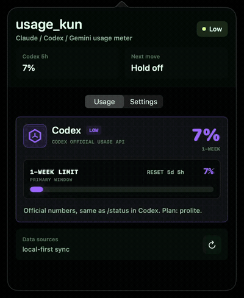

# usage-kun

<p align="right">
  <strong>English</strong> |
  <a href="README.ja.md">日本語</a>
</p>

**Monitor Claude Code, Codex & Gemini Usage at a Glance.**

Keep remaining quota and reset times in view from your macOS menu bar or Windows x64 tray. Optional Gemini support reads Antigravity IDE quota, not Gemini app usage or API billing.

**[Download for macOS (Apple Silicon)](https://github.com/Kohei-SAWADA/usage_kun/releases/download/v0.4.2/UsageKun-macOS.zip)** · **[Download for Windows x64](https://github.com/Kohei-SAWADA/usage_kun/releases/download/v0.4.3/UsageKun-Windows-x64.zip)** · [Setup guide](#quick-start) · [GIF demo](#demo)

macOS 14+; Windows 10/11 on Intel/AMD x64. Windows ARM is unsupported. The macOS app is ad-hoc signed and not notarized; the Windows app is unsigned.

## Demo



Edited from real recordings on this Mac: the menu-bar popover's Usage and Settings tabs, desktop-meter readings, and provider display controls. Displayed values can include a local-log estimate, including Claude's empty-log fallback. Antigravity was installed but not running during the check, so Gemini quota fetching is not shown; no IDE launch, sign-in, or token setup was performed. Windows interactions are not shown.

## At a glance

- Compact menu bar / system-tray readings and desktop meters.
- Claude Code and Codex usage, with duration-aware quota labels and reset times.
- Provider display switches and optional Gemini quota from a running, signed-in Antigravity IDE.

[Full features](#features) · [Data sources](#data-sources) · [Privacy](#privacy-model)

<p align="center">
  
</p>

<p align="center">
  
</p>


usage-kun is a small, privacy-first macOS menu bar and Windows system-tray app for keeping Codex, Claude, and optional Gemini (Antigravity) usage visible while you work.

It is built as a personal utility: a compact usage meter rather than a full analytics dashboard. It reads local CLI usage data by default and can optionally reuse Claude Code / Codex CLI sign-in tokens in read-only mode for official quota numbers. Codex labels follow the actual limit duration, including 5-hour and weekly limits. It does not store, refresh, or log those tokens.

Gemini support reads the 5-hour and weekly quota shown in **Models & Usage > Gemini Models** inside the Antigravity IDE. Enable it in Settings while Antigravity is open and signed in on the same computer. This is Antigravity's Gemini quota, not Gemini app usage or Gemini API billing.

This project is not affiliated with, endorsed by, or sponsored by OpenAI, Anthropic, or any other provider.

## Downloads

The latest Windows version is [v0.4.3](https://github.com/Kohei-SAWADA/usage_kun/releases/tag/v0.4.3). macOS remains [v0.4.2](https://github.com/Kohei-SAWADA/usage_kun/releases/tag/v0.4.2), with its existing download unchanged. Windows support is limited to Intel / AMD PCs (x64). Windows ARM, including Windows on Apple Silicon Macs, is no longer supported. macOS support, including Apple Silicon, is unchanged. Gemini (Antigravity) is available on macOS since v0.4.0 and Windows since v0.4.1.

Choose the current download for your platform:

| Platform | ZIP |
| --- | --- |
| macOS (Apple Silicon) | [UsageKun-macOS.zip](https://github.com/Kohei-SAWADA/usage_kun/releases/download/v0.4.2/UsageKun-macOS.zip) |
| Windows (Intel / AMD, x64) | [UsageKun-Windows-x64.zip](https://github.com/Kohei-SAWADA/usage_kun/releases/latest/download/UsageKun-Windows-x64.zip) |

Windows v0.4.3 keeps expired, stale, invalid, and unavailable quota unknown instead of assuming 100%. Claude local token totals do not establish subscription quota; enable opt-in authenticated usage sync for a reported quota. Codex quota is separate from ordinary ChatGPT chat limits and API billing. [Windows accuracy changes](docs/release-notes-v0.4.3.md).

For Windows, follow [Install On Windows](#install-on-windows) below. The ZIP includes the .NET runtime; no SDK or separate runtime installation is needed. Download the app ZIP from the table above or **Assets** on the release page. **Code > Download ZIP** and **Source code** contain development source files.

Setup: [Windows](#install-on-windows) / [macOS](#install-from-the-release-zip) / [Gemini](#enable-gemini-antigravity).

The screenshots below show an earlier macOS version with Codex and Claude. The current version also supports Gemini (Antigravity).

## Screenshots

usage-kun is designed to stay visible without becoming a dashboard. Click the menu bar icon in the top-right of macOS to open the popover, keep the pinned home meter at the top-left of the desktop, and use Settings to choose which of Codex, Claude, and Gemini (Antigravity) to show.

<p align="center">
  
</p>

<p align="center">
  <em>Menu bar popover opened from the top-right macOS icon.</em>
</p>

<p align="center">
  
</p>

<p align="center">
  <em>Pinned home meter at the top-left of the desktop.</em>
</p>

<p align="center">
  
</p>

<p align="center">
  <em>Settings screen with provider checkboxes for Codex-only, Claude-only, or both-provider display.</em>
</p>

## Features

- Native macOS menu bar app built with SwiftPM, AppKit, and SwiftUI, and native Windows system-tray app built with .NET 8 and WPF
- Compact macOS menu bar popover and Windows tray controls
- Optional pinned desktop widget on macOS and draggable floating meter on Windows
- Duration-aware Codex quota labels, including weekly-only plans, plus Claude Code quota bars
- Optional Gemini 5-hour and weekly quota, including reset times, from the running Antigravity IDE
- Per-provider checkboxes for Claude, Codex, and Gemini (Antigravity)
- Local-log usage estimates on macOS; fresh recorded Codex quota on Windows, with unknown values when quota cannot be established
- Optional official usage sync for Claude Code and Codex CLI sign-ins
- Low-usage and reset notifications for the packaged macOS app
- Read-only token reuse with no token persistence, refresh, or credential logging
- No telemetry and no bundled analytics

## Requirements

- macOS 14 or newer (Apple Silicon release ZIP), or Windows 10/11 (Intel / AMD, x64 only)
- Intel Mac users can build from source.
- For official Claude / Codex sync: an existing CLI sign-in on the same OS where usage-kun runs
- For Gemini: the Antigravity IDE running and signed in under the same OS user; enable Gemini in usage-kun Settings
- Source builds only: Swift 6 or newer and Xcode Command Line Tools on macOS; .NET 8 SDK on Windows

## Quick Start

### Install From The Release ZIP

On macOS:

1. Download `UsageKun-macOS.zip` from the [macOS v0.4.2 release](https://github.com/Kohei-SAWADA/usage_kun/releases/tag/v0.4.2).
2. Unzip it and move `UsageKun.app` to `/Applications` (or anywhere you like).
3. Open `UsageKun.app`.
4. To use official quotas, sign in to Claude Code or Codex on this Mac, then enable **Claude official usage** or **Codex official usage** under **Settings > Official usage**. For Gemini, see [Enable Gemini (Antigravity)](#enable-gemini-antigravity).

### First Launch: "Apple could not verify UsageKun is free of malware"

On first launch, macOS blocks the app with a dialog like:

> Apple could not verify "UsageKun" is free of malware that may harm your Mac or compromise your privacy.

**This is expected and does not mean the download is broken.** The app is signed but not notarized by Apple (notarization requires a paid Apple Developer account), so macOS cannot vouch for it automatically. You only need to approve it once:

1. In the warning dialog, click **Done** (do NOT click "Move to Trash").
2. Open **System Settings** > **Privacy & Security**.
3. Scroll down to the **Security** section. You will see a message saying "UsageKun" was blocked.
4. Click **Open Anyway** next to that message.
5. In the confirmation dialog, click **Open Anyway** again and authenticate with Touch ID or your password.

The app opens normally from then on; the warning does not come back until you download a new version.

Alternatively, you can clear the quarantine flag from Terminal instead (same effect, no dialogs):

```sh
xattr -d com.apple.quarantine /Applications/UsageKun.app
```

If you prefer not to trust a downloaded binary at all, build it yourself from source below — the result is identical and needs no Gatekeeper approval.

### Install On Windows

1. Open Windows **Settings > System > About** and check **System type**. An Intel / AMD PC with an x64-based processor is required. Windows ARM is unsupported, including Windows running on an Apple Silicon Mac.
2. Download [UsageKun-Windows-x64.zip](https://github.com/Kohei-SAWADA/usage_kun/releases/latest/download/UsageKun-Windows-x64.zip).
3. Right-click the downloaded ZIP, select **Extract All...**, and keep the extracted files together in a folder where you want to use the app.
4. Open that folder and double-click `UsageKun.exe`. No installer or separate .NET installation is required. The app appears in the system tray near the clock; expand the hidden icons if needed.
5. Right-click the usage-kun tray icon and choose **Settings...**. Under **Providers**, select the providers you use.
6. For official Claude / Codex quotas, first sign in to Claude Code or Codex **inside Windows**. Under **Sync sources**, check **Official Claude usage sync (opt-in)** and/or **Official Codex usage sync (opt-in)**, then click **Save**. Sign-ins on the Mac host are not reused by a Windows VM.
7. To add Gemini, follow the steps below. Use **Refresh now** from the tray menu to update the meter. You can change **Start with Windows** in Settings to control automatic startup, then click **Save**.

See the [Windows guide](docs/windows.md) for more setup details and platform limitations.

### Enable Gemini (Antigravity)

1. Open Antigravity and sign in on the same OS and user account where usage-kun is running. Keep the IDE open.
2. In usage-kun, enable Gemini:

| Platform | Settings |
| --- | --- |
| macOS | Turn on **Settings > Providers > Gemini (Antigravity)**. This enables both display and quota reading; changes save automatically. |
| Windows | Check **Providers > Show Gemini (Antigravity)** and **Sync sources > Read Gemini quota from Antigravity (opt-in)**, then click **Save**. |

3. Refresh usage-kun. The Gemini card shows the remaining 5-hour and weekly quota from Antigravity's **Models & Usage > Gemini Models**, with reset times when available.

Gemini is off by default. If quota is unavailable, open **Models & Usage** in Antigravity and refresh usage-kun again. Missing values remain unknown; they are not shown as 0% remaining. You do not need to enter Antigravity authentication tokens in usage-kun.

### Run From Source

Run from source on macOS:

```sh
swift run
```

Build the app bundle:

```sh
./Scripts/package_app.sh
open UsageKun.app
```

Run the lightweight core check:

```sh
swift build
swift run UsageKunCoreCheck
```

This repository includes `UsageKunCoreCheck` because some Command Line Tools only environments do not provide a working `XCTest` or Swift Testing setup.

To inspect the local Claude 5-hour estimate and calibration details:

```sh
swift run UsageKunCoreCheck --claude-estimate
```

For Windows source builds and checks, see [Windows: Build and check](docs/windows.md#build-and-check).

## Updating An Existing Install

Updates are installed manually; the app does not download or install them automatically. Your settings and calibration data are stored separately from the app, so no settings export or migration is needed. On macOS, keep `~/.codex`, `~/.claude`, `~/.claude.json`, and `~/Library/Application Support/usage_kun`. On Windows, keep `%USERPROFILE%\.codex`, `%USERPROFILE%\.claude`, `%USERPROFILE%\.claude.json`, and `%APPDATA%\usage_kun`. These contain the existing CLI sign-in/log data, plan information, and app preferences used after updating.

### If You Installed From Git

On macOS, from the repository directory you already cloned:

```sh
cd usage_kun
git pull
./Scripts/package_app.sh
open UsageKun.app
```

`package_app.sh` rebuilds the release executable, stops a running `UsageKun` process if one is active, and replaces the local `UsageKun.app` bundle.

### If You Used GitHub Download ZIP

On macOS, download the latest source ZIP from GitHub, unzip it, open Terminal in the unzipped `usage_kun` folder, and run:

```sh
./Scripts/package_app.sh
open UsageKun.app
```

### If You Used The Release ZIP

On macOS:

1. Download `UsageKun-macOS.zip` from the [macOS v0.4.2 release](https://github.com/Kohei-SAWADA/usage_kun/releases/tag/v0.4.2).
2. Quit the old usage-kun app from the menu bar.
3. Unzip `UsageKun-macOS.zip`.
4. Replace your old `UsageKun.app` with the new one at the same location, such as `/Applications/UsageKun.app`.
5. Open the new `UsageKun.app` and refresh the meter. Your existing provider and sync settings are retained.

If you want to move the app to a different location, first turn off **Settings > Meter > Launch at login** in the old app. Quit it, move the new app, then open it and turn **Launch at login** back on if desired. If macOS requests approval, allow usage-kun in **System Settings > General > Login Items**.

On first launch of the new version, macOS may show the "could not verify" warning again; approve it the same way as in [First Launch](#first-launch-apple-could-not-verify-usagekun-is-free-of-malware). If official Claude sync is enabled, macOS may ask for Claude Code Keychain access again after the update.

### If You Used The Release ZIP (Windows)

1. On an Intel / AMD Windows PC (x64), download the latest `UsageKun-Windows-x64.zip` from [Releases](https://github.com/Kohei-SAWADA/usage_kun/releases/latest). Windows ARM installations have no supported update from v0.4.2 onward; the x64 ZIP is not a supported replacement on Windows ARM.
2. Right-click the existing tray icon and choose **Quit usage_kun**.
3. Use **Extract All...** to unpack the new ZIP, then replace the complete app contents in your existing app folder with the extracted files. Keeping the same folder preserves existing shortcut and startup paths. No installer or uninstall step is required.
4. Run `UsageKun.exe` from that folder, then choose **Refresh now** from the tray menu. Your saved settings and calibration remain in `%APPDATA%\usage_kun`.

If you move the app to a different folder, update your shortcuts. Open the new `UsageKun.exe`, then open **Settings > Behavior**, check **Start with Windows** if desired, and click **Save** so startup uses the new location.

## Data Sources

usage-kun uses a staged data model:

1. Local logs: macOS reads Claude Code and Codex usage estimates. Windows reads fresh recorded Codex quota and Claude token totals; token totals alone leave Claude quota unknown.
2. Official usage sync: opt-in only; reuses CLI sign-ins on the same OS in read-only mode to fetch official quota numbers and limit durations. Available on macOS and Windows.
3. Claude calibration (macOS only): successful Claude usage sync can calibrate the local 5-hour cap estimate for later fallback use. Windows does not derive quota from token caps.
4. Gemini (Antigravity): opt-in only; reads the running IDE's local quota service for **Gemini Models** 5-hour and weekly remaining usage and reset times. It does not read Gemini app usage or Gemini API billing, or substitute CLI logs or another provider's quota when unavailable.

See [docs/providers.md](docs/providers.md) for details.

## Privacy Model

- No telemetry.
- No cloud sync.
- No analytics SDK.
- No conversation content display.
- No automatic browser cookie reading.
- CLI sign-in tokens are not refreshed, copied, stored by this app, or logged.
- Antigravity's temporary credential is used only with its local service and is never saved or logged.
- No Admin API keys or manual cookie headers are collected in this release.

See [PRIVACY.md](PRIVACY.md) for the full privacy note.

## Repository Layout

```text
Sources/UsageKun/
  main.swift
  Services/
    LaunchAtLoginService.swift
    UsageNotifier.swift
  Views/

Sources/UsageKunCore/
  Config/
    AppConfig.swift
    ClaudeCalibrationStore.swift
  OnboardingDetector.swift
  Providers/
    AntigravityUsageService.swift
    CLIOAuthUsageService.swift
    LocalLogUsageService.swift
  UsageNotificationPlanner.swift
  UsageSnapshot.swift
  UsageService.swift

Tests/UsageKunCoreCheck/
  main.swift

Windows/
  UsageKun.Windows.sln
  src/
    UsageKun.App/
    UsageKun.Core/
  tests/
    UsageKun.Core.Check/
    UsageKun.UI.Check/

assets/screenshots/
  pinned-desktop-meter.png
  menu-bar-popover.png
  settings-providers.png

assets/
  usage-kun-thumbnail.png
  usage-kun-icon.png

Packaging/
  AppIcon.icns
  Info.plist

Scripts/
  package_app.sh
  package_release_zip.sh
  package_windows.ps1
  preflight_publication.sh
```

## Why Another Usage Meter?

There are already several AI usage monitors and menu bar utilities. usage-kun exists as a small, auditable implementation tuned for one workflow: keep Claude, Codex, and optional Gemini (Antigravity) limits visible without opening a dashboard, while keeping authentication handling explicit and local.

The emphasis is on:

- local-first behavior
- clear provider boundaries
- small native macOS and Windows UI
- readable Swift and C# code
- privacy-first credential handling

## Limitations

- Official usage endpoints can change without notice.
- macOS Claude local-log quota estimates are best-effort. Windows leaves Claude quota unknown without usable authenticated quota. They deduplicate repeated JSONL rows by `requestId` and `message.id`, and can self-calibrate after opt-in official Claude usage sync succeeds.
- Official sync requires existing Claude Code / Codex CLI sign-in state on the same OS where usage-kun runs.
- Gemini requires the running, signed-in Antigravity IDE. Its local API may change, and unavailable quota stays unknown.
- Notifications are intended for the packaged macOS `UsageKun.app` build; Windows toast notifications are not implemented.
- The macOS app is ad-hoc signed but not notarized, so first launch of a downloaded copy needs a one-time Gatekeeper approval. The Windows executable is unsigned.
- Windows reads Codex live quota from `logs_2.sqlite` and session JSONL logs; auxiliary token/thread statistics from `state_5.sqlite` are not implemented. See the [Windows guide](docs/windows.md#validation-and-limits) for Windows validation status.

## Release History

### v0.4.3 — Windows quota accuracy

- Keep expired, stale, invalid, unavailable, and missing quota unknown; retain decimal percentages instead of rounding 99.5% to 100%.
- Stop converting Claude conversation token caps into subscription remaining quota on Windows.
- Keep Codex windows and provider identity distinct. macOS remains on its existing v0.4.2 asset.

Details: [docs/release-notes-v0.4.3.md](docs/release-notes-v0.4.3.md)

### v0.4.2

- Limit Windows support and downloads to Intel / AMD PCs (x64); end Windows ARM support, including Windows on Apple Silicon Macs.
- Fix stale Windows Codex usage by also reading the local live quota database and selecting the newest valid General rate-limit record across it and session logs; model-specific limits no longer overwrite that quota.
- Keep macOS behavior and Apple Silicon support unchanged, and clarify update steps for existing Windows and macOS installations.

Details: [docs/release-notes-v0.4.2.md](docs/release-notes-v0.4.2.md)

### v0.4.1

- Publish native Windows x64 and ARM64 downloads with official Claude / Codex usage sync and Gemini quota from Antigravity. Windows ARM support ended in v0.4.2.
- Add Windows build, core checks, WPF integration checks, and packaging to CI.
- Keep macOS behavior from v0.4.0 and align the release version.

Details: [docs/release-notes-v0.4.1.md](docs/release-notes-v0.4.1.md)

### v0.4.0

- Add optional Gemini (Antigravity) quota display on macOS.
- Fix pinned widget refresh/settings controls; Settings opens in its own window.
- Show Codex 1W or 5H labels according to the actual limit duration.

Details: [docs/release-notes-v0.4.0.md](docs/release-notes-v0.4.0.md)

### v0.3.1

Responsive layout polish.

- Published the provider-aware variable sizing behavior as a patch release.
- The popover and pinned home meter automatically use a smaller height in Claude-only or Codex-only mode, and expand again when both providers are visible.
- The header metric and desktop status label follow the currently visible provider set instead of leaving empty two-provider spacing.

Details: [docs/release-notes-v0.3.1.md](docs/release-notes-v0.3.1.md)

### v0.3.0

Per-provider visibility.

- Added Settings > Providers with Claude and Codex checkboxes. Only checked providers are shown in the menu bar, popover, and desktop meter; unchecked providers are not fetched at all. Both are checked by default.
- Added the Usage Kun app icon to the packaged macOS app and refreshed the README screenshots for the popover, pinned home meter, and provider settings.
- Resized the popover and pinned home meter automatically for Claude-only or Codex-only display, and made the header metric follow the visible provider.

Details: [docs/release-notes-v0.3.0.md](docs/release-notes-v0.3.0.md)

### v0.2.2

Plan-detection fixes for the local estimates.

- Fixed Max 20x plans being treated as Max 5x in the local Claude estimate (usage was overstated ~4x). Detection now reads the rate-limit tier fields in `~/.claude.json`, where the 5x/20x distinction actually lives.
- Added a "Claude plan" setting (Auto / Pro / Max 5x / Max 20x) for when auto-detection is wrong. Local estimate only; official sync is always exact.
- The Codex live rate-limit reader no longer requires the primary window to be exactly 300 minutes.

Details: [docs/release-notes-v0.2.2.md](docs/release-notes-v0.2.2.md)

### v0.2.1

Packaging and hardening fixes; no feature changes.

- Fixed the release zip shipping an app whose incomplete signature made Gatekeeper reject downloaded copies as "damaged". The bundle is now fully ad-hoc signed with sealed resources and verified during packaging.
- Stopped archiving extended attributes as AppleDouble `._*` files in the release zip.
- Codex local databases are now opened with `sqlite3 -readonly -batch`.
- Restricted the CI workflow token to read-only access.
- Documented release-zip installation and the one-time Gatekeeper approval.

Details: [docs/release-notes-v0.2.1.md](docs/release-notes-v0.2.1.md)

### v0.2.0

This update turns usage-kun into a clearer quota monitor for both short and weekly windows.

- Added first-class 5-hour and 1-week usage windows for Claude Code and Codex.
- Redesigned the pinned desktop meter and menu bar popover with primary and secondary quota bars.
- Kept the menu bar compact as `usage` plus a remaining-usage meter.
- Added one-click onboarding for official CLI usage sync.
- Added optional low-usage and reset notifications for the packaged app.
- Removed retired Admin API and Cookie/OAuth code paths.
- Added publication preflight checks for local-only files, build output, app bundles, and release artifacts.

Full notes: [docs/release-notes-v0.2.0.md](docs/release-notes-v0.2.0.md)

### v0.1.1

This update focused on making Claude Code 5-hour estimates more reliable while preserving the existing Codex behavior.

- Improved Claude local-log accuracy by deduplicating repeated JSONL usage rows with the `(requestId, message.id)` pair.
- Recalibrated initial Claude 5-hour caps for deduplicated weighted tokens.
- Added automatic Claude cap calibration after opt-in official Claude usage sync succeeds.
- Added `swift run UsageKunCoreCheck --claude-estimate` for checking the local Claude estimate.
- Fixed Claude cost estimation for Opus, Fable, Mythos, and cache-write token handling.

Full notes: [docs/release-notes-v0.1.1.md](docs/release-notes-v0.1.1.md)

### v0.1.0

Initial public release.

- Native macOS menu bar usage meter for Claude and Codex.
- Optional pinned desktop widget.
- Local-first usage display.
- Privacy-first credential handling and no telemetry.

## Development

On macOS:

```sh
swift build
swift run UsageKunCoreCheck
```

Package a release-style app bundle:

```sh
./Scripts/package_app.sh
```

Run the publication preflight:

```sh
./Scripts/preflight_publication.sh
```

Build a local release zip:

```sh
./Scripts/package_release_zip.sh
```

For Windows build, core checks, WPF checks, and packaging commands, see [Windows: Build and check](docs/windows.md#build-and-check).

## License

MIT. See [LICENSE](LICENSE).


### Login startup

Fresh installations enable login startup once, after the macOS app is moved to `/Applications` or `~/Applications` (Windows: start `UsageKun.exe` from its permanent folder). Change **Launch at Login** / **Start with Windows** in Settings at any time. Existing app settings and OS-disabled login items are preserved during upgrades; legacy installs with no startup entry stay off because an old explicit off cannot be distinguished from never having enabled it. Registration is not repeated on every launch or usage refresh.

macOS uses `SMAppService.mainApp`; Windows uses one per-user `HKCU` Run value. Settings reports the actual OS status, pending approval, or failure. If the OS blocks startup, approve it in macOS **General > Login Items** or Windows **Apps > Startup** yourself; the app does not bypass OS controls or request administrator access. Replace upgrades at the same location. An enabled installation moved to another permanent location repairs its existing registration once; disabled items stay disabled. Before moving an older version, turn startup off at the old location.

Logout/login and physical Windows startup have not been tested for this change. Automated checks use isolated registration backends and reconstructed saved preferences; they do not log you out or modify your real startup items.
